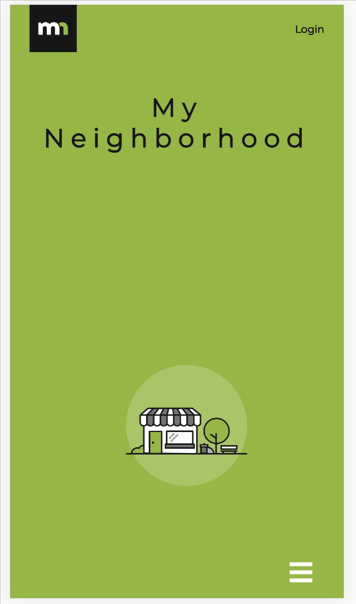

# My Neighborhood

## Concept :bulb:

We set out to make a mobile app that focuses on the news, events or services within your local community. Giving people that comfort and safety everyone desires when moving into a new neighborhood is what drove us to making this app.

## Contributors

* Rob Ross
* Eddson Blanco
* Diego Solorio
* John Webster

## Set-up :computer: :page_facing_up:

Deployed at <https://shielded-tor-66455.herokuapp.com>

Please note that on heroku, the app is asleep and will require several seconds to start

For technical details and setup information, please refer to our [TECH.md](docs/TECH.md) document. Contains the following
* Set up development environment
* Deployment
* Sass and css
* Debug logging
* Authentication
* Testing and continuous integration

## Model :clapper:
**You will be greeted to our lovely homepage**

>With our home screen, we made it very convenient for people to navigate our app by using our menu, which we deliberately place on the bottom right

**Once you login, you're able to create alerts**

>If any alerts were created before, they will appear on the Alerts page. Once you select 'Create new Alert' you will be asked to enter a bit of information.

**Selecting News, will take you to our scraped KCRA site**

>In our controller, we have a scrape.js file that uses axios to grab the site's data, with targeted elements then use a class in our component to render it

**We make it easy for people to search for a service within the community**

>**Note** The icons are placeholders for local sites. We'll continue to make progress on this in the future.

## Technology :robot: