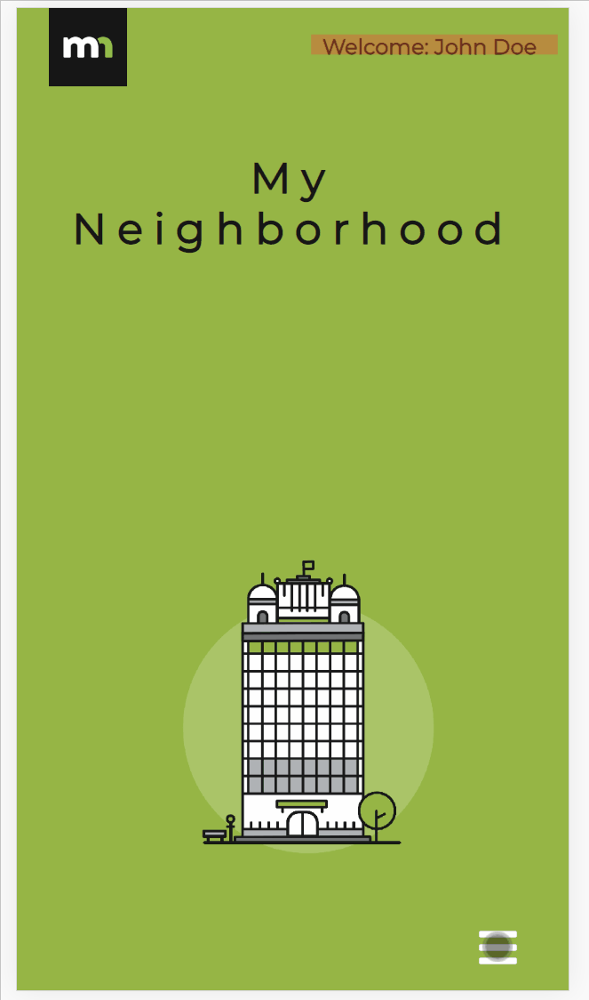
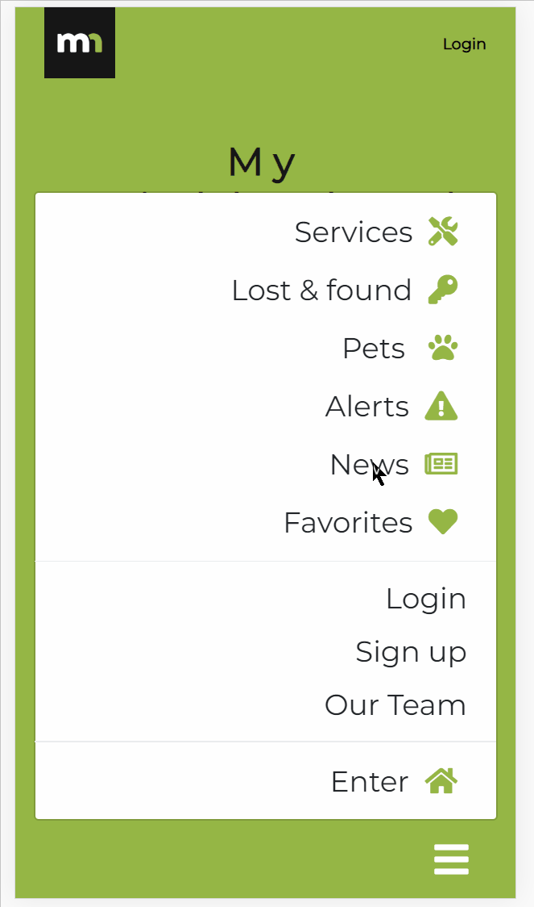
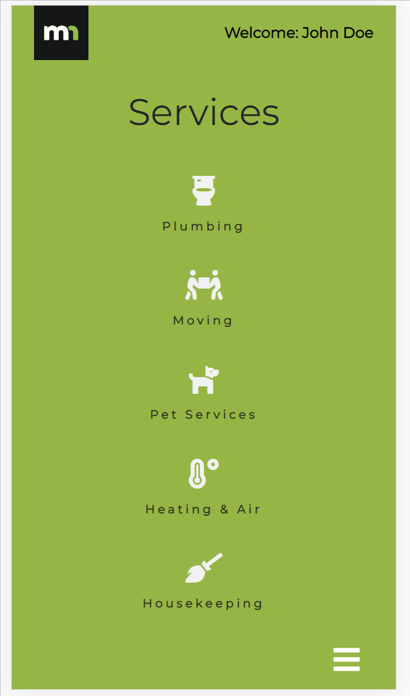

# My Neighborhood

## Contributors

* Rob Ross
* Eddson Blanco
* Diego Solorio
* John Webster

## Set-up :computer: :page_facing_up:
    For an in-depth guide and helpful tips, please refer to our [TECH.md](client/TECH.md) document.

## Concept :bulb:
    We set out to make a mobile app that focuses on the news, events or services within your community. Giving people that comfort and safety everyone desires when moving into a new neighborhood is what drove us to making this app.

## Model :clapper:
**You will be greeted to our lovely homepage**

>With our home screen, we made it very convenient for people to navigate our app by using our menu, which we deliberately place on the bottom right

**Once you login, you're able to create alerts**

>If any alerts were created before, they will appear on the Alerts page. Once you select 'Create new Alert' you will be asked to enter a bit of information.

**Selecting News, will take you to our scraped KCRA site**

>In our controller, we have a scrape.js file that uses axios to grab the site's data, with targeted elements then use a class in our component to render it

**We make it easy for people to search for a service within the community**

>**Note** The icons are placeholders for local sites. We'll continue to make progress on this in the future.

## Technology :robot: